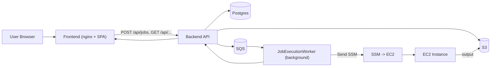

# Architecture Overview

## Components

- `backend` - ASP.NET Core Web API
  - Stores job metadata in PostgreSQL
  - Uploads input files and execution output to S3
  - Uses SQS for queued execution messages
  - Uses SSM to execute a command on an EC2 instance
  - Calculates billing after job completion

- `frontend` - React app
  - Job submission form
  - Job list view
  - Job detail and billing view
  - Uses generated API client from Swagger/OpenAPI

- `db` - PostgreSQL
  - Stores job records, project data, and status lifecycle

## Data flow

1. User submits a job through the frontend.
2. Backend stores job metadata and optionally uploads an input file to S3.
3. Backend enqueues a job message to SQS.
4. Background worker polls SQS and triggers execution via EC2 SSM.
5. The EC2 instance executes a small command, producing output metadata.
6. Backend uploads the execution result to S3 and updates job status.
7. Billing is calculated after execution completes.

## Important design decisions

- Job execution is decoupled from job creation using SQS and a hosted worker.
- S3 is used for input/output references, not for actual job storage in the database.
- Billing is calculated in the executor so costs reflect actual run duration.
- Frontend is intentionally small and uses API-generated types for safer integration.

## AWS services used

- S3: input/output file storage
- SQS: execution queue
- SSM: EC2 command execution
- (Optional) RDS for Postgres when deployed to AWS

## Local stack

The local stack is bootstrapped with Docker Compose:

- `db` - local PostgreSQL
- `backend` - backend API
- `frontend` - built React app served by nginx
